# 🚀 Highly-Available Web Application on AWS

> **CitiusCloud Services LLP – AWS Intern Hands-On Task**  
> Deployed a production-style, highly available web application on AWS demonstrating end-to-end skills across VPC networking, compute, load balancing, auto scaling, and security best practices, #This is only for learning and demostrating purpose only.#This is only for learning and demostrating purpose only. .#This is only for learning and demostrating purpose only. 
---

## Architecture Overview

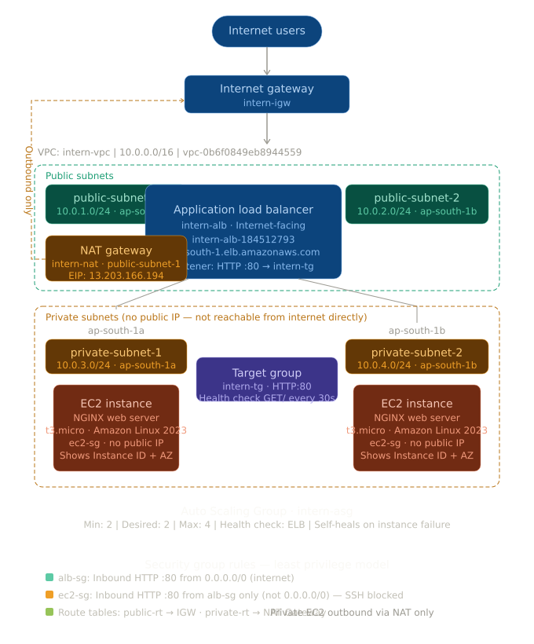

## Flow Diagram

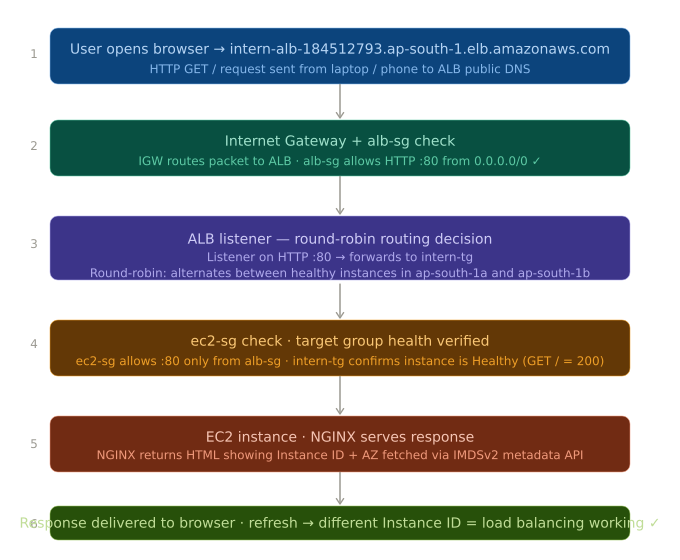

---

## 🛠️ Tech Stack

| Service | Purpose |
|---|---|
| **VPC** | Isolated network with public/private subnet separation |
| **EC2 (t3.micro)** | Web servers running NGINX |
| **Application Load Balancer** | Distributes HTTP traffic across 2 AZs |
| **Auto Scaling Group** | Maintains min 2 instances, self-heals on failure |
| **NAT Gateway** | Allows private EC2s to reach internet for updates |
| **Internet Gateway** | Provides internet access to public subnets |
| **Security Groups** | Least-privilege firewall rules |
| **CloudFormation** | Infrastructure as Code (IaC) automation |

---

## 📁 Project Structure

```
AWS-Highly-Available-Web-Application/
│   AWS-HA-WebApp-Guide.md          ← Step-by-step setup guide
│   README.md                       ← This file
│
├───CLOUDFORMATION TEMPLATE/
│       intern-ha-webapp.yaml       ← Full CFT to deploy entire stack
│
└───screenshot/
    │   vpc_details.png
    │   subnets.png
    │   internet_gateway.png
    │   NAT_gateway.png
    │   route_table.png
    │   alb_sg.png
    │   ec2_sg.png
    │   ec2_template.png
    │   alb_created_with_alb_sg.png
    │   target-gp.png
    │   ASG.png
    │   ASG_EC2_created.png
    │
    └───testing/
            instance_id_changing.mp4        ← Load balancing demo video
            deleted_ec2_new_ASG_ec2.png     ← ASG self-healing proof
            new_ec2_created_by_ASG.png      ← New instance launched by ASG
            ssh_ec2.png                     ← SSH timeout proof
            Least_Privilege_Security_Groups.png
```

---

## Part 1 – Infrastructure Setup

### 1. Custom VPC

Created a custom VPC spanning 2 Availability Zones with CIDR `10.0.0.0/16`.

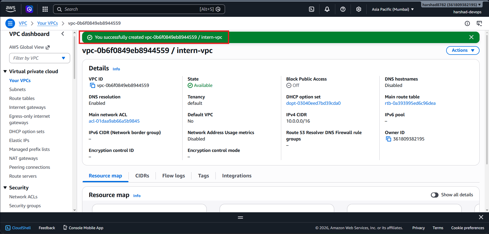

| Property | Value |
|---|---|
| VPC ID | `vpc-0b6f0849eb8944559` |
| Name | `intern-vpc` |
| IPv4 CIDR | `10.0.0.0/16` |
| State | Available |

---

### 2. Subnets

Created 4 subnets — 2 public and 2 private, one per Availability Zone.

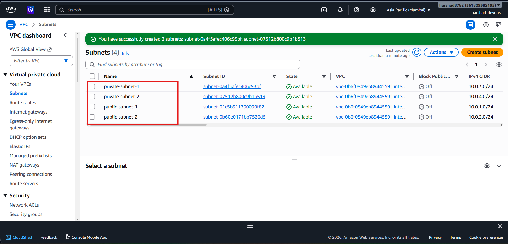

| Subnet Name | Type | AZ | CIDR |
|---|---|---|---|
| `public-subnet-1` | Public | `ap-south-1a` | `10.0.1.0/24` |
| `public-subnet-2` | Public | `ap-south-1b` | `10.0.2.0/24` |
| `private-subnet-1` | Private | `ap-south-1a` | `10.0.3.0/24` |
| `private-subnet-2` | Private | `ap-south-1b` | `10.0.4.0/24` |

> Auto-assign public IPv4 enabled on both public subnets only.

---

### 3. Internet Gateway

Created and attached `intern-igw` to `intern-vpc` to allow public subnets internet access.

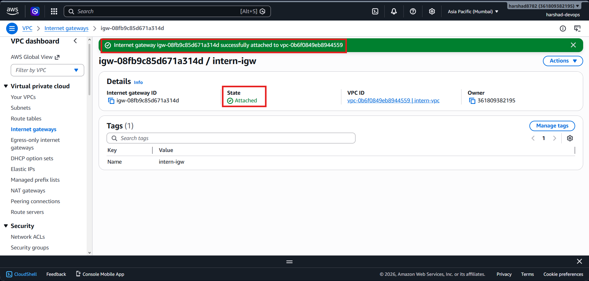

| Property | Value |
|---|---|
| IGW ID | `igw-08fb9c85d671a314d` |
| Name | `intern-igw` |
| State | **Attached** ✅ |
| VPC | `intern-vpc` |

---

### 4. NAT Gateway

Deployed `intern-nat` in `public-subnet-1` to allow private EC2 instances outbound internet access for package installs.

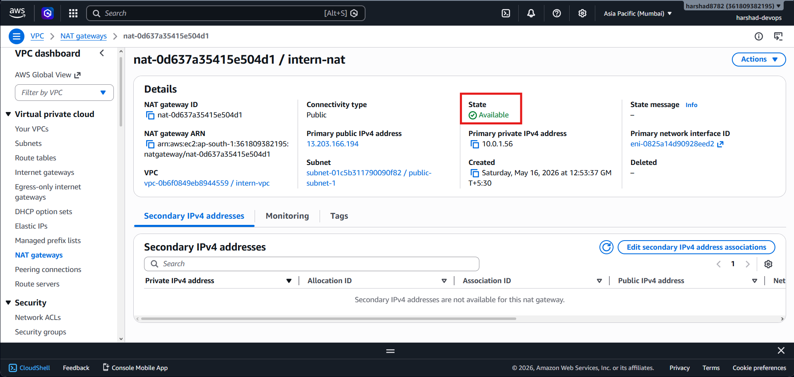

| Property | Value |
|---|---|
| NAT GW ID | `nat-0d637a35415e504d1` |
| Subnet | `public-subnet-1` |
| Connectivity | Public |
| Public IP | `13.203.166.194` |
| Private IP | `10.0.1.56` |
| State | **Available** ✅ |

---

### 5. Route Tables

Configured two route tables:
- **public-rt** → routes `0.0.0.0/0` to Internet Gateway → associated with both public subnets
- **private-rt** → routes `0.0.0.0/0` to NAT Gateway → associated with both private subnets

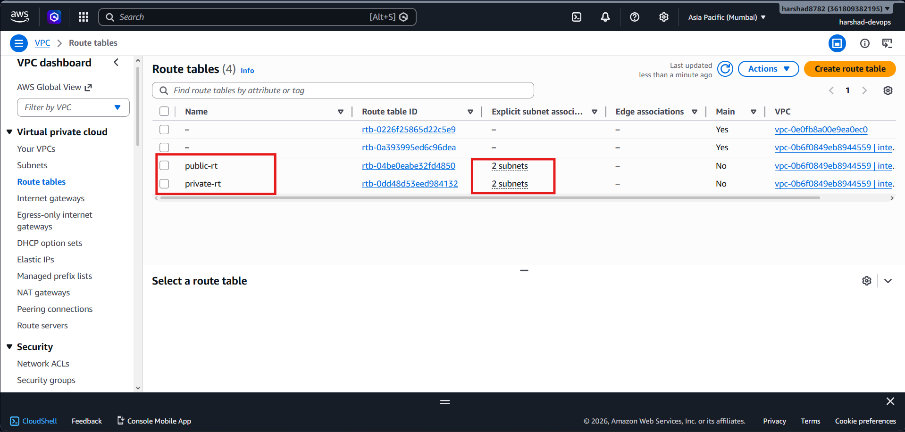

| Route Table | Target | Associated Subnets |
|---|---|---|
| `public-rt` | Internet Gateway | `public-subnet-1`, `public-subnet-2` |
| `private-rt` | NAT Gateway | `private-subnet-1`, `private-subnet-2` |

---

### 6. Security Groups

Two security groups following the **least-privilege model**:

#### ALB Security Group (`alb-sg`)
Allows HTTP traffic from the entire internet to reach the load balancer.

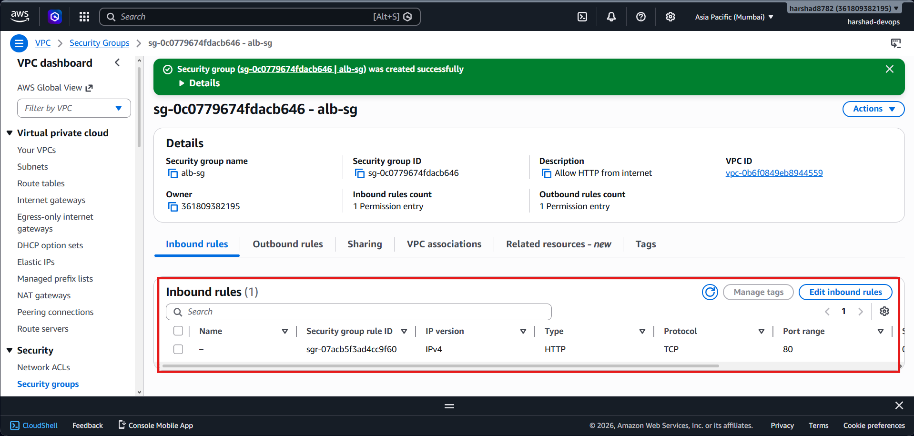

| Direction | Type | Port | Source |
|---|---|---|---|
| Inbound | HTTP | 80 | `0.0.0.0/0` |
| Outbound | All | All | `0.0.0.0/0` |

#### EC2 Security Group (`ec2-sg`)
EC2 instances **only accept traffic from the ALB** — not from the open internet.

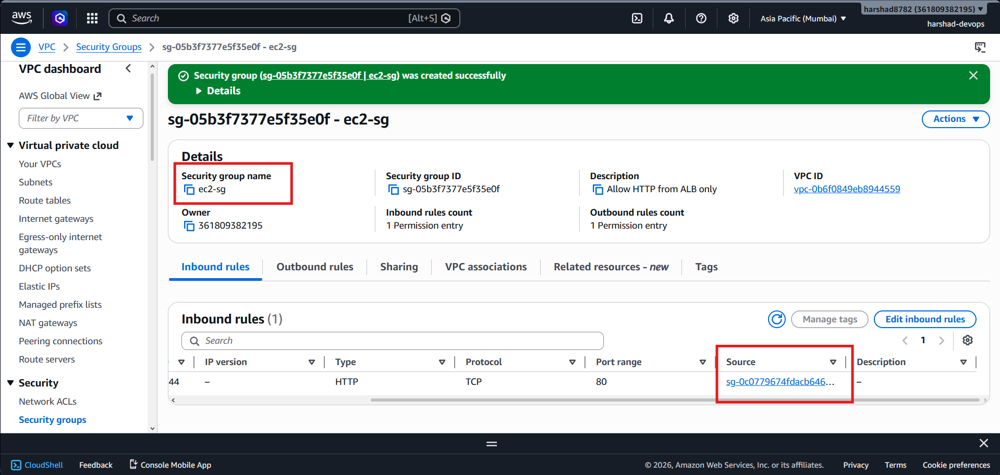

| Direction | Type | Port | Source |
|---|---|---|---|
| Inbound | HTTP | 80 | `sg-0c0779674fdacb646 (alb-sg)` ← SG reference |
| Outbound | All | All | `0.0.0.0/0` |

> ✅ No SSH rule — proves private subnets are truly private.

---

## Part 2 – Application Layer

### 7. EC2 Launch Template

Created `intern-lt` with Amazon Linux 2023 and the following NGINX user data script:

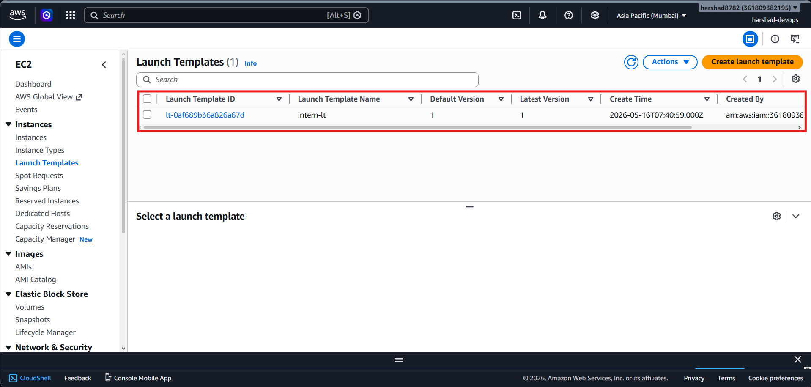

```bash
#!/bin/bash
yum update -y
yum install -y nginx
systemctl start nginx
systemctl enable nginx

# Enable IMDSv2 token
TOKEN=$(curl -s -X PUT "http://169.254.169.254/latest/api/token" \
  -H "X-aws-ec2-metadata-token-ttl-seconds: 21600")

# Get instance metadata
INSTANCE_ID=$(curl -s -H "X-aws-ec2-metadata-token: $TOKEN" \
  http://169.254.169.254/latest/meta-data/instance-id)
AZ=$(curl -s -H "X-aws-ec2-metadata-token: $TOKEN" \
  http://169.254.169.254/latest/meta-data/placement/availability-zone)

# Write custom webpage
cat > /usr/share/nginx/html/index.html << 'HTMLEOF'
<!DOCTYPE html>
<html>
<body style="background:#1a1a2e;color:white;text-align:center;font-family:Arial;padding:60px">
  <h1 style="color:#00d4ff">🚀 CitiusCloud HA Web App</h1>
  <p>Instance: <b>INSTANCE_ID_HERE</b></p>
  <p>Zone: <b>AZ_HERE</b></p>
  <p>Refresh to see load balancing! ↻</p>
</body>
</html>
HTMLEOF

sed -i "s/INSTANCE_ID_HERE/$INSTANCE_ID/g" /usr/share/nginx/html/index.html
sed -i "s/AZ_HERE/$AZ/g" /usr/share/nginx/html/index.html
```

| Property | Value |
|---|---|
| Template Name | `intern-lt` |
| AMI | Amazon Linux 2023 |
| Instance Type | `t3.micro` |
| Key Pair | None (private subnet — no direct SSH) |
| Security Group | `ec2-sg` |

---

### 8. Target Group

Created `intern-tg` with health checks configured.

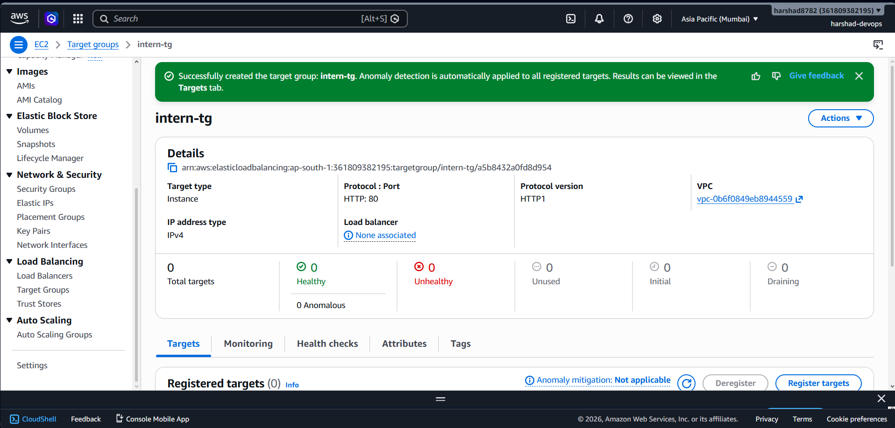

| Property | Value |
|---|---|
| Name | `intern-tg` |
| Target Type | Instance |
| Protocol | HTTP : 80 |
| Health Check Path | `/` |
| Health Check Interval | 30 seconds |
| Healthy Threshold | 2 |

---

### 9. Application Load Balancer

Deployed `intern-alb` across both public subnets with `alb-sg`.

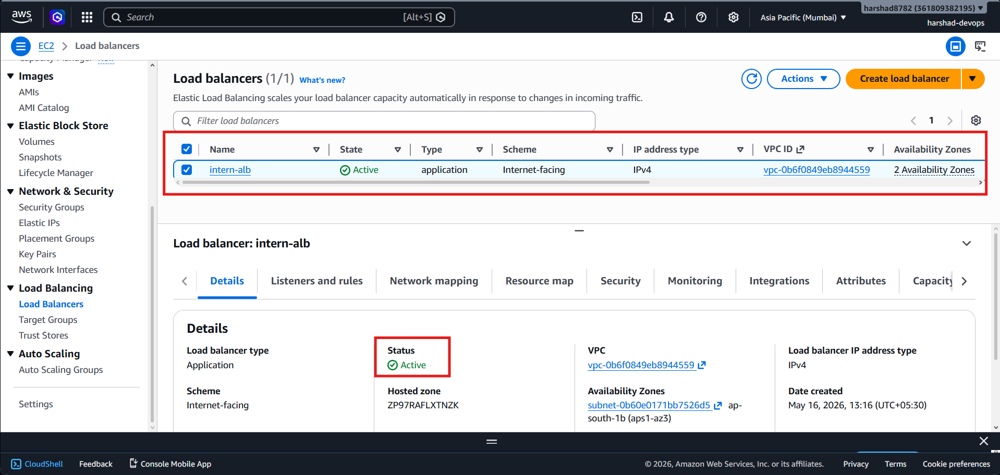

| Property | Value |
|---|---|
| Name | `intern-alb` |
| Type | Application |
| Scheme | Internet-facing |
| Subnets | `public-subnet-1`, `public-subnet-2` |
| Security Group | `alb-sg` |
| DNS Name | `intern-alb-184512793.ap-south-1.elb.amazonaws.com` |
| Status | **Active** ✅ |

---

### 10. Auto Scaling Group

Configured `intern-asg` to maintain minimum 2 instances across private subnets.

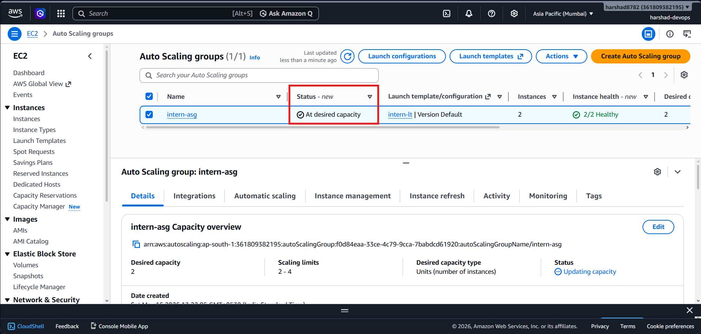

| Property | Value |
|---|---|
| Name | `intern-asg` |
| Launch Template | `intern-lt` |
| Subnets | `private-subnet-1`, `private-subnet-2` |
| Min | 2 |
| Desired | 2 |
| Max | 4 |
| Target Group | `intern-tg` |
| Health Check | ELB |
| Status | **At desired capacity — 2/2 Healthy** ✅ |

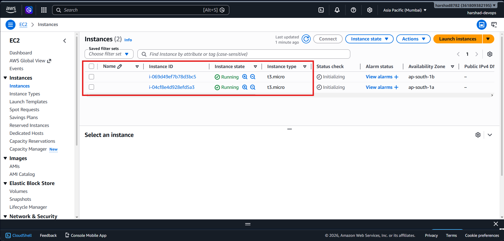

---

## ✅ Validation & Testing

### Check 1 – Load Balancing Works

Opened ALB DNS in browser and refreshed multiple times — different **Instance IDs** and **Availability Zones** appeared each time, confirming load balancing is working.

🎥 **Demo Video:**

https://github.com/user-attachments/assets/instance_id_changing.mp4

> *(See `screenshot/testing/instance_id_changing.mp4`)*

---

### Check 2 – Auto Scaling Self-Healing

Manually terminated one EC2 instance. The ASG automatically detected the failure and launched a **brand new replacement instance** within 3 minutes.

**Before (instance terminated):**

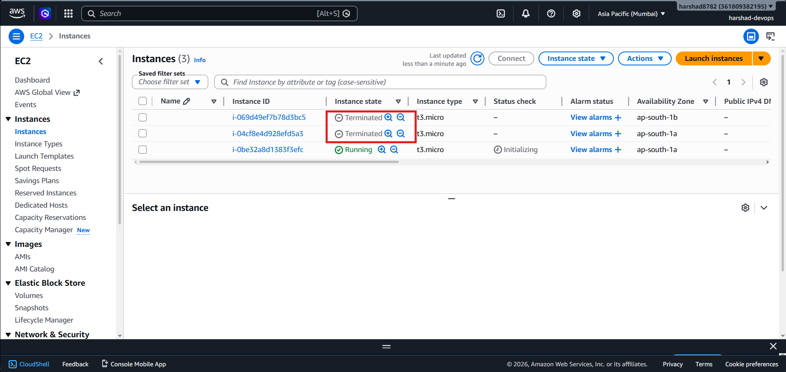

**After (ASG replaced it):**

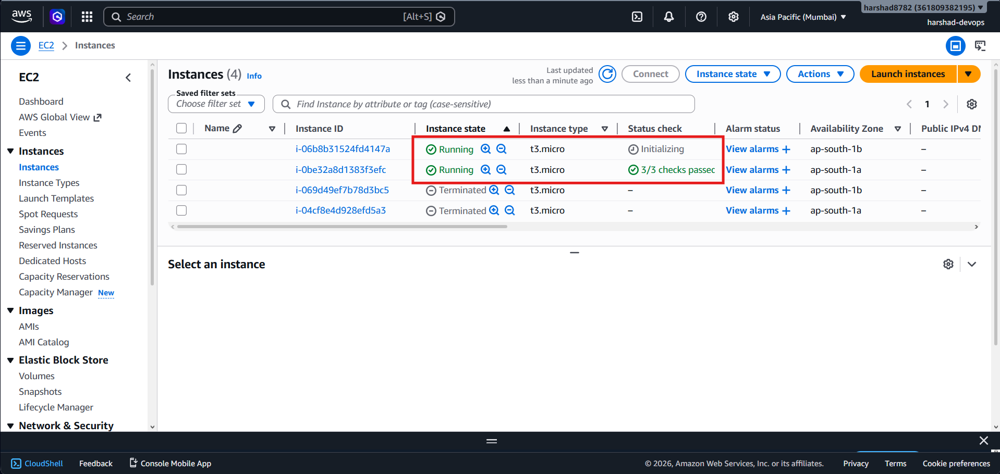

> ✅ ASG maintained desired capacity of 2 instances automatically.

---

### Check 3 – Private Subnets Are Private

Attempted SSH directly into private EC2 instances from local machine — **both connections timed out**, confirming:
- No public IP assigned to private instances
- No SSH inbound rule in `ec2-sg`
- Instances are truly in private subnets

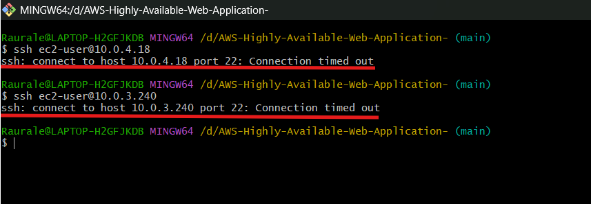

```bash
$ ssh ec2-user@10.0.4.18
ssh: connect to host 10.0.4.18 port 22: Connection timed out

$ ssh ec2-user@10.0.3.240
ssh: connect to host 10.0.3.240 port 22: Connection timed out
```

---

### Check 4 – Least-Privilege Security Groups

`ec2-sg` inbound rule shows source as `sg-0c0779674fdacb646 (alb-sg)` — not `0.0.0.0/0`. EC2 instances only accept traffic **from the ALB**, never directly from the internet.

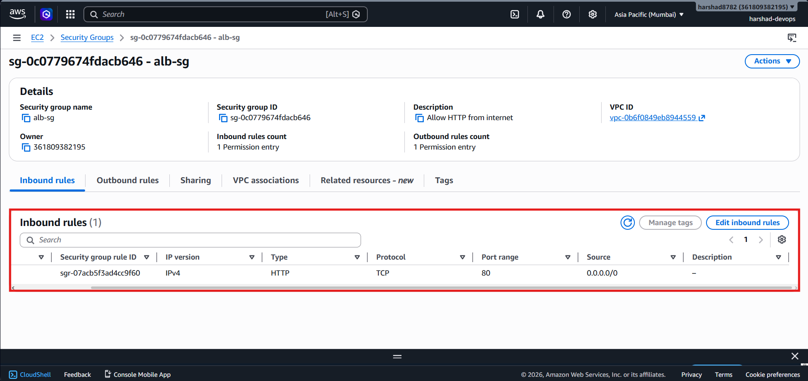

---

## ☁️ CloudFormation Template

The entire infrastructure can be deployed automatically using the included CloudFormation template.

📄 **File:** `CLOUDFORMATION TEMPLATE/intern-ha-webapp.yaml`

**To deploy:**
1. AWS Console → CloudFormation → Create stack
2. Upload `intern-ha-webapp.yaml`
3. Stack name: `intern-ha-stack`
4. Click Next → Next → Create stack
5. Wait ~5 minutes — find the ALB DNS in **Outputs** tab

**Resources created by CFT:**
- VPC + 4 Subnets + IGW + NAT Gateway
- Route Tables + Security Groups
- Launch Template + ALB + Target Group
- Auto Scaling Group

---

## 🗑️ Teardown

All resources deleted in the correct order to avoid errors and charges:

```
ASG → ALB → Target Group → Launch Template → NAT Gateway
→ Elastic IP → Internet Gateway → Subnets → Route Tables
→ Security Groups → VPC
```

> ⚠️ Always wait ~5 minutes after deleting NAT Gateway before releasing Elastic IP.

---

## 📊 Evaluation Summary

| # | Check | Result |
|---|---|---|
| 1 | Load balancing — different IDs on refresh | ✅ PASS |
| 2 | ASG self-healing — auto replacement | ✅ PASS |
| 3 | Private subnets — SSH timed out | ✅ PASS |
| 4 | Least-privilege — ec2-sg references alb-sg | ✅ PASS |
| 5 | Complete teardown | ✅ DONE |

---

## 👨‍💻 Author

**Harshad Jagdish Raurale**  
DevOps / Cloud Enthusiast

[](https://github.com/harshad8782)
[](https://www.linkedin.com/in/harshad-raurale-9a4b4826b/)

---

> ⭐ If you found this helpful, please consider giving it a star!